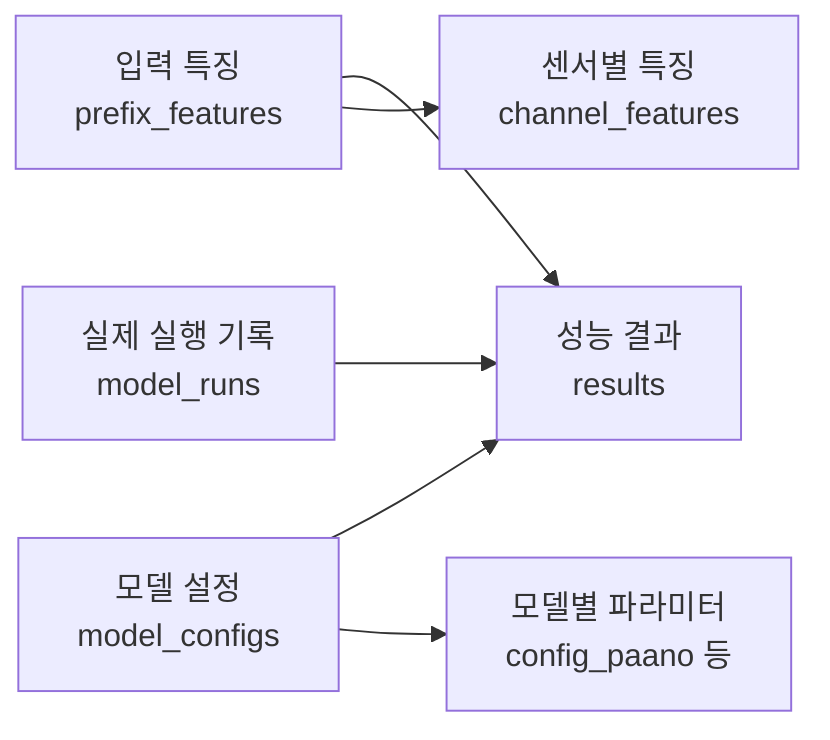

# 엑셀 기준 ERD 저장 구조

[ERDCloud에 넣을 SQL](erdcloud_schema.sql)을 35개에서 14개 테이블로 줄였다.
엑셀의 네 묶음에 실험 정보와 실제 실행 기록을 더한 핵심 표 6개, 모델별 파라미터 표 8개다.
이 문서와 SQL은 기존 파일을 교체한 현재 설계다.

| 핵심 테이블 | 엑셀에서 찾을 내용 | 한 행의 의미 |
| --- | --- | --- |
| prefix_features | 파일명·q·N·관측 행 수·센서 수·입력 특징 | CSV 하나의 q-prefix |
| channel_features | 센서명·mean·std·median·ACF·IQR·차분·이동·스펙트럼 엔트로피 | 한 prefix의 센서 하나 |
| model_configs | 실행모델·전체설정 ID·후보번호·전체 설정 JSON | 모델 설정 한 벌 |
| results | seed·완료여부·평가점수·head·점수 파일 | CSV·q·설정·seed·head별 결과 |
| model_runs | 실제 실행 ID·memory 수·epoch·시간·GPU 메모리 | 실제 실행 시도 한 번 |
| experiment_info | 전체 저장 묶음의 신원과 근거 파일 | 이 DB의 실험 정보 한 행 |

핵심 흐름은 입력 특징과 모델 설정을 results에서 연결하는 것이다.
results에서 model_runs를 따라가면 실제 실행 비용과 학습 결과를 찾는다.
experiment_info는 DB 전체의 설명이므로 각 결과에 experiment_id를 반복하지 않는다.

모델별 상세 표는 엑셀의 개별 파라미터 열을 유지한다. 운영 관리용 표를 추가한 것이 아니다.

| 상세 테이블 | 포함하는 모델 |
| --- | --- |
| config_mwvar | MWVAR |
| config_sqdiff | SQDIFF_LAST1·SQDIFF_LAST3·SQDIFF_CENTERED5 |
| config_one_liner_ensemble | MWVAR96_SQDIFF_LAST3·MWVAR96_SQDIFF_CENTERED5 |
| config_pca | PCA_LEGACY |
| config_paano | PaAno |
| config_gdn | GDN |
| config_timercd | TimeRCD |
| config_tspulse | TSPulse |

숫자 파라미터를 전부 JSON 안에 숨기지 않았다. patch_size·learning_rate·epochs 등의 열과
TSPulse의 supports_time·supports_fft·supports_pred·supports_ensemble을 그대로 남겼다.
candidate_order는 model_configs에서 한 번 저장한다. 상세 표의 model 열은 부모 설정과
모델 종류가 같은지 검사하는 복합 외래키에 쓰인다.

| 연결 | 키와 역할 |
| --- | --- |
| 입력 특징 → 채널 특징 | prefix_feature_id. 센서별 기본키는 prefix_feature_id + channel_index |
| 입력 특징 → 결과 | prefix_feature_id + csv_id. 다른 파일의 특징을 붙이지 못한다. |
| 모델 설정 → 상세·실행·결과 | config_id. 상세 표는 model까지 함께 대조한다. |
| 실행 기록 → 결과 | physical_execution_id + csv_id + config_id + seed. 실제 시도와 같은 파일·설정·seed인지 검사한다. |
| 결과의 기본키 | prefix_feature_id + config_id + seed + score_variant. q와 head가 다른 결과를 보존한다. |

csv_file은 엑셀에 보여줄 파일명이고 csv_id는 출처 경로를 포함한 파일 신원이다.
results의 csv_id는 잘못된 파일 연결을 막기 위해 남긴 열이다. N·관측량·센서 수·모델명은
결과에 다시 복사하지 않고 prefix_features와 model_configs를 조인해 엑셀 성능표 11열을 만든다.
성능 CSV는 기존처럼 파일·head별로 나누며, 여러 head를 합쳐 조회할 때는 score_variant를 표시한다.

입력 특징과 채널 특징 CSV는 기존 열 순서를 유지하고 아래 특성 네 개를 끝에 붙인다.
성능표 11열과 모델 설정은 그대로다. 입력 특징의 새 열은 대응하는 채널별 유효값의 중앙값이며,
열 이름은 각각 channel_interquartile_range_median, channel_difference_q90_iqr_ratio_median,
channel_median_shift_iqr_ratio_median, channel_spectral_entropy_median이다.

| 채널 특징 열 | 산식과 유효 조건 |
| --- | --- |
| interquartile_range | 유한값의 Q75−Q25. 분위수는 linear 보간을 쓴다. 유한값이 없으면 NULL이다. |
| difference_q90_iqr_ratio | 인접 차분 절댓값의 Q90/IQR. 행이 2개 이상이고 전부 유한하며 IQR이 양수여야 한다. |
| median_shift_iqr_ratio | abs(후반 중앙값−전반 중앙값)/IQR. n//2에서 나누며, 행이 4개 이상이고 전부 유한하며 IQR이 양수여야 한다. |
| spectral_entropy | DC를 뺀 양의 주파수 rfft 전력을 확률로 바꾼 Shannon 엔트로피를 log(주파수 bin 수)로 나눈다. 행이 4개 이상이고 전부 유한한 비상수 채널에서 계산하며 단측 전력을 두 배로 늘리지 않는다. |

새 값은 모두 NULL을 허용한다. IQR·차분 비율·중앙값 이동 비율은 0 이상이고 스펙트럼
엔트로피는 0~1이다. 빈 입력·비유한값·IQR 0 등 통계별 미정의 사유와 유효 개수는
feature_details_json·channel_details_json에 남긴다. 특성을 만들려고 결측값을 이어 붙이거나
상수 채널을 지우지 않는다. 이 산식의 신원은 prefix_features.v2다.

실제 실행 ID는 기존 실행 이력의 run_id를 그대로 쓴다. 재시도는 다른 ID와 attempt_index로
남긴다. 같은 TSPulse 실행을 두 q와 네 head가 참조하면 results는 여덟 행이고 model_runs의
해당 시도는 한 행이다. 시간·메모리는 model_runs에만 저장하며 결과 행수만큼 비용을 더하지 않는다.
실행 완료와 채점 완료는 별도 상태다. 실패·미채점의 VUS-PR은 NULL이다.
complete에는 0~1의 VUS-PR, 평가기 SHA, ell_max ID와 ledger 참조가 필요하다. 실행 완료로
표시한 행에는 실제 실행 ID와 점수·metadata·manifest 참조도 있어야 한다. SQL은 해당 증거의
NULL·빈 문자열을 거부하고 SHA가 소문자 16진수 64자리인지 검사한다. 파일 내용과 실행 상태의
일치는 적재 코드에서 확인한다.

파일·평가 단위·실행 계획·head 목록·산출물·선택 집단·fold·최종 요청을 각각 나눴던 테이블은
제거했다. 필요한 정보는 원본 파일과 JSON으로 보존한다.

| 보존 위치 | 묶어 둔 정보 |
| --- | --- |
| experiment_info.identity_json / environment_json | 예산·코드·입력·저장 계약의 신원, 실제 실행 환경 |
| experiment_info.evidence_files_json | structural_exclusions, 선택표, LOFO, candidate_audit, tuning_support, final_policy_membership 등 원본 파일의 종류·경로·SHA |
| prefix_features.feature_details_json | 기존 series·원본 SHA·채널 순서 SHA·identity_json·feature SHA·입력 범위·특징 산식·유효 개수·NULL 사유·수집 비용 |
| channel_features.channel_details_json | 유효값 수·상수 여부·통계별 NULL 사유 |
| model_configs.settings_json | 기존 전체 설정 원본. 소스·checkpoint·전후처리와 파라미터의 출처 |
| model_runs.run_details_json | 원본 실행 이력과 참조, snapshot·학습 checkpoint·scaler의 경로·SHA, 내부 검증·통계 범위·장치·실행 제어·기타 실측값·NULL 사유 |
| results.metadata_file / metadata_sha256 | raw·smoothed 두 배열, 채널별 보조 배열, 정렬·전후처리 정보 |
| results.source_reference_json | 기존 실패 합성 physical_execution_id·training_group_id와 출처별 참조값 |

엑셀의 q별 선택 결과는 기존 선택 JSON·CSV에서 읽는다. analysis_kind·group_id·q_percent·
config_id·family·score_variant·fallback·window_rule_id, TSPulse 창·head 후보 원표와 LOFO
학습·제외 파일의 근거를 그대로 보존한다. 테이블을 줄이려고 선택 정보를 삭제하거나 다시 계산하지 않는다.
성능표의 점수 파일 경로는 여러 q에서 반복 참조할 수 있지만 실제 점수 파일은 복사하지 않는다.

이 설계는 현행 저장 방식처럼 실험 하나당 DB 하나다. DB를 열 때 experiment_info가 정확히
한 행인지, 봉인한 실험 신원과 일치하는지 검사해야 한다. 다른 실험의 행을 합쳐 넣지 않는다.
MySQL DDL은 ERD 설계다. 실제 SQLite writer는 기존 6개 테이블을 유지하면서 새 특징 열과
검증·CSV 내보내기를 확장하며 추천 DB schema는 3을 쓴다. 14개 MySQL 테이블을 SQLite에
그대로 옮기는 작업은 이번 범위가 아니다. 과거 봉인 DB의 schema를 자동 변경하거나 v1 특징을
v2로 승계하지 않으며 새 저장 계약으로 만든 DB에서 원격 검증한다.

실제 SQLite에는 `recommendation_inputs` VIEW도 둔다. 원시 mean·std·IQR을 제외하고
채널별 IQR/std의 중앙값·무차원 시간 특징·상수 비율·유효 비율과 NULL 사유를 조회한다.
새 테이블이나 모델별 특징 복제는 만들지 않는다. 동일 이름의 CSV와 입력 열 계약을 기존
단일 튜닝 명령의 백업·내보내기·인수 영수증에 연결한다. 산식과 단위·검증상의 한계는
[추천 입력 계약](tuning_feature_capture_prompt.md#추천-입력의-단위중복결측-처리)을 따른다.

이 ERD의 적재 계약은 기존 검증도 유지한다. 상세 값과 settings_json의 일치, 모델에 맞는 head·seed,
등록 후보, 실제 실행 q, 점수 파일의 SHA·head·정렬, NULL 사유를 확인한다.
모델 상세는 해당 모델군에 정확히 한 행이어야 한다. 구조적 제외 원표의 prefix/config에는
결과를 넣지 않는다. 결과가 연결한 실행의 상태·물리 q와 점수 증거도 대조한다.
이 교차 행·파일 검증까지 SQL의 외래키가 대신 보장하지는 않는다.

Dev18의 observed_row는 floor(N×q/100)이다. HAI의 복수 학습 파일은 각 세션에서 prefix를
자른 뒤 길이를 합한다. q_percent와 physical_q는 5·10·20·40·60·80·100만 허용한다.
SQL은 0≤observed_row≤floor(N×q/100)을 검사하고, Dev18의 정확한 행 수와 HAI의 세션별
합은 적재 시 대조한다. HAI 입력 목록·세션 순서·원본 범위는 metadata에 보존하며, 새 HAI
특징 수집은 이번에 구현하지 않았다. 결과가 없는 조합을 가상 seed나 0점으로 채우지 않는다.
실패 기록의 합성 ID를 실제 실행 ID로 넣지 않고 source_reference_json에 원문을 남긴다.

SQL은 MySQL 문법이며 ERDCloud의 Import에 파일 내용 전체를 넣는 용도다.
이전 35개 테이블이 들어 있는 ERD에 합쳐 넣지 말고 빈 ERD에 새로 가져온다.
배치는 SQL에 포함되지 않는다. 기존 세션의 로그인 제한으로 실제 가져오기는 미확인이며,
이번에는 14개 테이블·13개 외래키의 키·자료형·참조와 엑셀 필드를 정적으로 대조했다.
로컬 DB·테스트·Python·YAML·모델은 실행하지 않았다.

이 저장 변경은 정적 검토를 마쳤으며 원격 검증 전이다.
저장 변경의 다음 시작점은 ERD 화면 검토와 새 특징·SQLite 저장·재개·CSV 내보내기의 원격 검증이다.
이 변경은 모델 파라미터와 선택식을 다루지 않는다.
