# GHL 데이터셋 탐색적 데이터 분석(EDA) 보고서

> **분석 대상:** 로컬 `TSB-AD-M`의 GHL 25개 CSV  
> **분석 축:** 데이터 구조, 파일명 메타데이터, 품질, 라벨 이벤트, 분포 이동, 다변량·시간 특성  
> **중요 전제:** timestamp가 없으므로 sample index를 시간축으로 쓰며, 각 파일은 연결하지 않는 별도 시계열 경계로 처리한다. 이는 통계적 독립성을 뜻하지 않는다.

---

## 1. 핵심 요약

GHL은 19개 입력 특성과 하나의 이진 `Label`을 가진 별도 다변량 시계열 파일 25개다. 전체 4,975,025개 관측치 중 파일명으로 지정된 학습 prefix는 1,233,688개이고, 이후 평가 구간은 3,741,337개다. 이상 포인트는 56,569개(1.137%)이며 연속된 이상 구간으로 묶으면 54개 이벤트다. 각 파일은 계산 경계로는 분리하지만, 동일한 GHL 공정 모델과 실험 설계에서 유래하므로 통계적으로 독립적인 iid 표본으로 가정하지 않는다.

데이터 품질 측면에서 특성 결측값은 0개, 무한값은 0개다. 모든 학습 prefix의 라벨은 0이다. 25개 파일 모두 파일명의 `1st_*` 값이 실제 첫 이상 포인트의 **0-based index**와 정확히 일치한다. 사람이 행 번호를 1부터 셀 경우 실제 위치는 파일명 값보다 1 크다.

모든 파일의 열 이름 집합은 같지만 id 3, 7, 11, 13, 17, 18, 22, 23, 24, 25의 10개 파일은 `C_temperature.T`와 `HT_temperature.T`의 열 순서가 기준 파일과 반대다. Pandas처럼 이름으로 선택하면 문제가 없지만, 원시 배열의 열 위치를 고정해서 읽으면 두 온도 특성이 뒤바뀔 수 있다.

### 핵심 수치

| 항목 | 결과 |
| --- | ---: |
| 별도 시계열 파일 | 25개 |
| 입력 특성 | 19개 |
| 전체 관측치 | 4,975,025개 |
| 학습 prefix | 1,233,688개 |
| 평가 구간 | 3,741,337개 |
| 이상 포인트 | 56,569개 (1.137%) |
| 연속 이상 이벤트 | 54개 |
| 이벤트 길이 | 최소 84, 중앙값 1066, 최대 1863 samples |
| 결측값 / 무한값 | 0 / 0 |
| 열 순서 변형 파일 | 10개 |

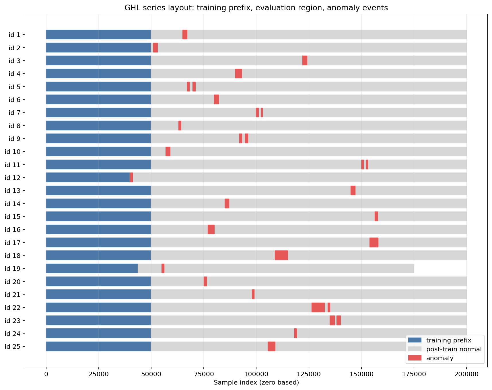

---

## 2. 데이터 구성과 index 의미

각 파일명은 `GHL_id_<id>_Sensor_tr_<n>_1st_<m>.csv` 형식이다.

- `id`: 별도 시계열 파일 식별자
- `tr_n`: 앞에서부터 n개 행이 학습 prefix
- `1st_m`: 첫 이상 포인트의 0-based index
- CSV 행 자체에는 timestamp가 없으므로 sample 간 실제 시간 간격은 파일만으로 알 수 없다.

따라서 `n_points=1000`인 이벤트를 1000초 또는 특정 시간으로 바꾸어 해석할 근거는 없다. 본 보고서는 모든 길이와 lag를 sample 단위로 기록한다.

| series_id | n_rows | train_length | evaluation_rows | first_anomaly_index_0based | clean_gap_after_train | anomaly_count | anomaly_rate_pct | event_count |
| --- | --- | --- | --- | --- | --- | --- | --- | --- |
| 1 | 200001 | 50000 | 150001 | 65001 | 15001 | 1850 | 0.924995 | 2 |
| 2 | 200001 | 50000 | 150001 | 51001 | 1001 | 1847 | 0.923495 | 2 |
| 3 | 200001 | 50000 | 150001 | 122001 | 72001 | 1919 | 0.959495 | 2 |
| 4 | 200001 | 50000 | 150001 | 90001 | 40001 | 2713 | 1.35649 | 3 |
| 5 | 200001 | 50000 | 150001 | 67147 | 17147 | 2283 | 1.14149 | 2 |
| 6 | 200001 | 50000 | 150001 | 80001 | 30001 | 1866 | 0.932995 | 2 |
| 7 | 200001 | 50000 | 150001 | 100001 | 50001 | 1695 | 0.847496 | 2 |
| 8 | 200001 | 50000 | 150001 | 63030 | 13030 | 1168 | 0.583997 | 1 |
| 9 | 200001 | 50000 | 150001 | 92001 | 42001 | 2387 | 1.19349 | 2 |
| 10 | 200001 | 50000 | 150001 | 57001 | 7001 | 1855 | 0.927495 | 2 |
| 11 | 200001 | 50000 | 150001 | 150001 | 100001 | 1546 | 0.772996 | 2 |
| 12 | 200001 | 39938 | 160063 | 40038 | 100 | 1051 | 0.525497 | 1 |
| 13 | 200001 | 50000 | 150001 | 145001 | 95001 | 1849 | 0.924495 | 2 |
| 14 | 200001 | 50000 | 150001 | 85076 | 35076 | 1771 | 0.885496 | 2 |
| 15 | 200001 | 50000 | 150001 | 156462 | 106462 | 1239 | 0.619497 | 1 |
| 16 | 200001 | 50000 | 150001 | 77001 | 27001 | 2728 | 1.36399 | 3 |
| 17 | 200001 | 50000 | 150001 | 154001 | 104001 | 3583 | 1.79149 | 4 |
| 18 | 200001 | 50000 | 150001 | 109001 | 59001 | 5549 | 2.77449 | 4 |
| 19 | 175001 | 43750 | 131251 | 55001 | 11251 | 1129 | 0.645139 | 1 |
| 20 | 200001 | 50000 | 150001 | 75110 | 25110 | 1191 | 0.595497 | 1 |
| 21 | 200001 | 50000 | 150001 | 98001 | 48001 | 971 | 0.485498 | 1 |
| 22 | 200001 | 50000 | 150001 | 126448 | 76448 | 6492 | 3.24598 | 5 |
| 23 | 200001 | 50000 | 150001 | 135001 | 85001 | 3734 | 1.86699 | 3 |
| 24 | 200001 | 50000 | 150001 | 118124 | 68124 | 1009 | 0.504497 | 1 |
| 25 | 200001 | 50000 | 150001 | 105568 | 55568 | 3144 | 1.57199 | 3 |

id 19를 제외한 파일은 200,001행이고 id 19는 175,001행이다. 학습 prefix는 대부분 50,000행이며 id 12는 39,938행, id 19는 43,750행이다.

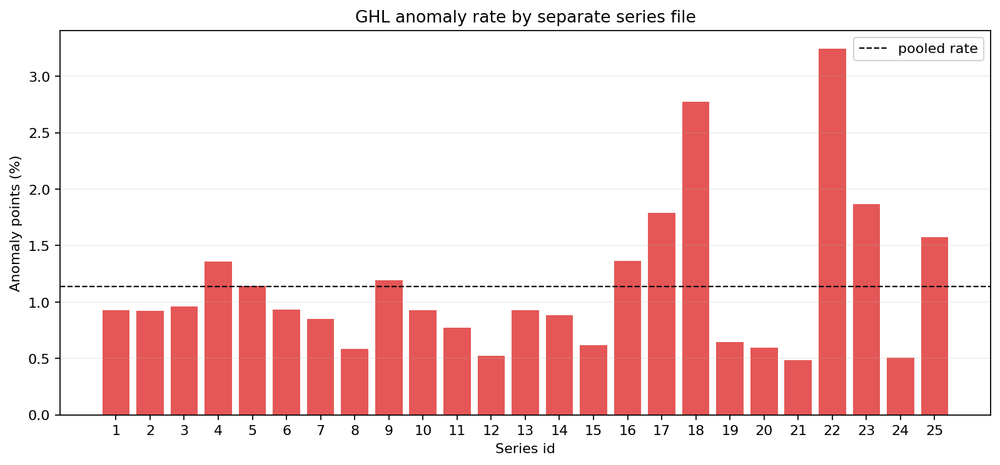

---

## 3. 스키마 및 데이터 품질

### 3.1 스키마

19개 특성 이름과 `Label` 열은 모든 파일에 존재한다. 단, 10개 파일에서 두 온도 열의 순서가 바뀐다. 본 EDA는 기준 열 이름 목록으로 모든 프레임을 재정렬한 뒤 계산했다.

### 3.2 결측·무한값·상수 특성

- 특성 결측값: 0개
- 특성 무한값: 0개
- 전체 범위 상수 특성: 0개 — 없음
- 학습 prefix 상수 특성: 0개 — 없음

`feature_catalog.csv`의 cardinality는 최대 200개까지 정확히 추적하며, 그보다 많으면 `high_cardinality`로 분류한다. 상수나 저카디널리티 특성은 모델에 무조건 제거할 대상이라기보다 상태 신호일 수 있으므로, 학습 구간과 평가 구간의 support 차이를 함께 확인해야 한다.

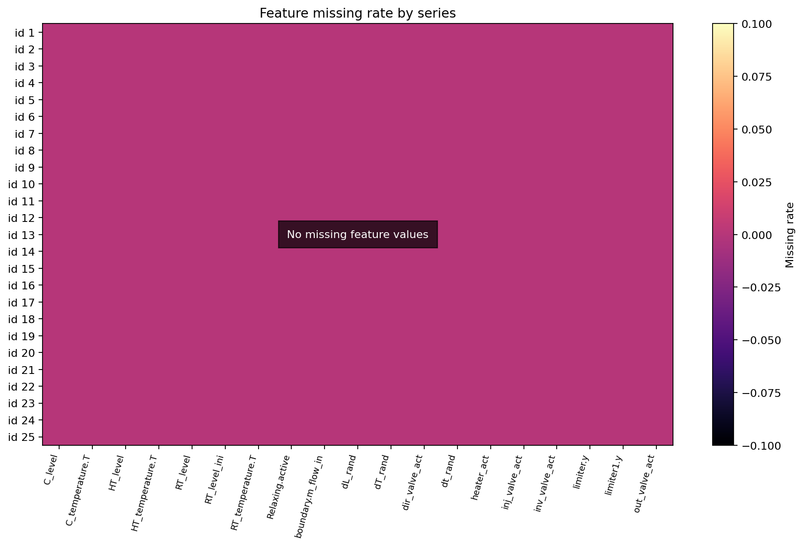

---

## 4. 라벨과 이상 이벤트 구조

학습 prefix 안의 양성 라벨은 0개로, 모든 파일에서 0이다. 이상 비율은 파일마다 다르며 가장 높은 5개 파일은 다음과 같다.

| series_id | anomaly_count | anomaly_rate_pct | event_count | first_anomaly_index_0based |
| --- | --- | --- | --- | --- |
| 22 | 6492 | 3.24598 | 5 | 126448 |
| 18 | 5549 | 2.77449 | 4 | 109001 |
| 23 | 3734 | 1.86699 | 3 | 135001 |
| 17 | 3583 | 1.79149 | 4 | 154001 |
| 25 | 3144 | 1.57199 | 3 | 105568 |

연속된 `Label=1`을 하나의 이벤트로 묶으면 총 54개다. 이벤트 길이는 최소 84, 중앙값 1066, 최대 1863 samples다. 포인트 단위 클래스 불균형과 이벤트 단위 불균형은 다르므로 이후 평가는 둘을 구분해야 한다.

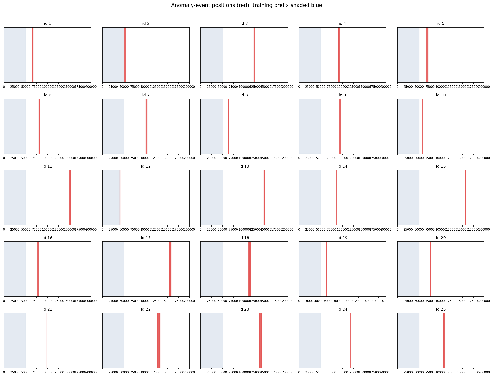

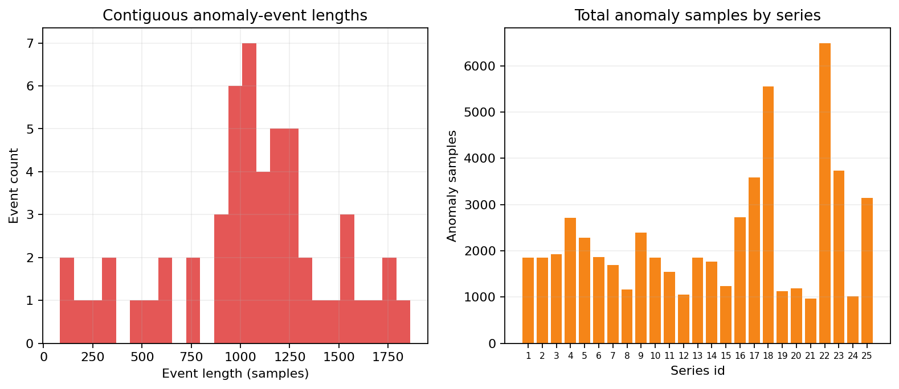

---

## 5. 이후 정상 구간과 이상 구간의 특성 차이

파일별로 학습 prefix 이후의 `Label=0`과 `Label=1` 전체 행을 비교하고, KS 통계량을 25개 파일 동일 가중치로 요약했다. pooled 비교만 사용하면 특정 파일의 크기와 baseline이 결과를 지배할 수 있어 macro 평균을 주 결과로 사용했다.

| feature | contributing_files | mean_ks_statistic | median_ks_statistic | min_ks_statistic | max_ks_statistic | mean_absolute_mean_shift_sd |
| --- | --- | --- | --- | --- | --- | --- |
| C_level | 25 | 0.727803 | 0.714981 | 0.511973 | 0.998635 | 0.877018 |
| C_temperature.T | 25 | 0.727803 | 0.714981 | 0.511973 | 0.998635 | 1.0737 |
| dL_rand | 25 | 0.701988 | 0.672315 | 0.469421 | 0.963051 | 0.815925 |
| dT_rand | 25 | 0.701988 | 0.672315 | 0.469421 | 0.963051 | 0.815925 |
| limiter.y | 25 | 0.690952 | 0.672315 | 0.469421 | 0.92443 | 0.794189 |
| RT_level_ini | 25 | 0.690935 | 0.681371 | 0.456354 | 0.978974 | 0.830022 |
| HT_temperature.T | 25 | 0.648336 | 0.631048 | 0.444119 | 0.896566 | 1.40009 |
| RT_level | 25 | 0.625346 | 0.65647 | 0.206506 | 0.947804 | 0.572289 |
| dt_rand | 25 | 0.577635 | 0.518809 | 0.253094 | 0.979178 | 0.631229 |
| limiter1.y | 25 | 0.577635 | 0.518809 | 0.253094 | 0.979178 | 0.631229 |

파일·특성 조합 중 KS가 가장 큰 사례는 다음과 같다. 동일 특성이 모든 파일에서 같은 정도로 반응한다고 가정하면 안 된다.

| series_id | feature | left_count | right_count | ks_statistic | absolute_mean_difference_in_left_sd |
| --- | --- | --- | --- | --- | --- |
| 12 | C_temperature.T | 159012 | 1051 | 0.998635 | 7.02856 |
| 12 | C_level | 159012 | 1051 | 0.998635 | 1.91215 |
| 2 | C_temperature.T | 148154 | 1847 | 0.982586 | 3.02399 |
| 2 | C_level | 148154 | 1847 | 0.982586 | 1.70921 |
| 12 | dt_rand | 159012 | 1051 | 0.979178 | 2.06495 |
| 12 | limiter1.y | 159012 | 1051 | 0.979178 | 2.06495 |
| 19 | RT_level_ini | 130122 | 1129 | 0.978974 | 2.91235 |
| 15 | dt_rand | 148762 | 1239 | 0.977561 | 2.12103 |
| 15 | limiter1.y | 148762 | 1239 | 0.977561 | 2.12103 |
| 19 | dt_rand | 130122 | 1129 | 0.970858 | 1.74369 |
| 19 | limiter1.y | 130122 | 1129 | 0.970858 | 1.74369 |
| 14 | dT_rand | 148230 | 1771 | 0.963051 | 2.25292 |

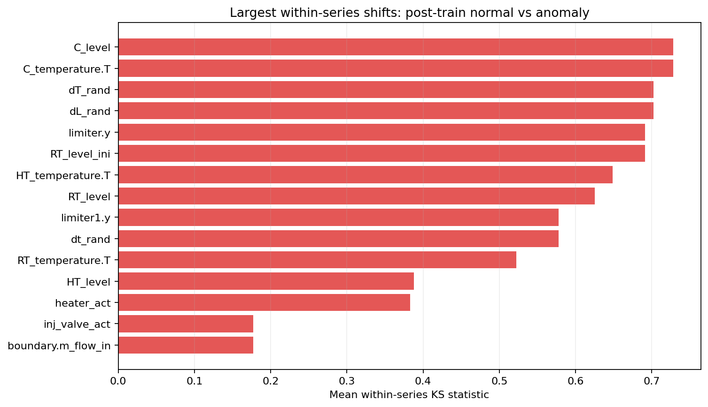

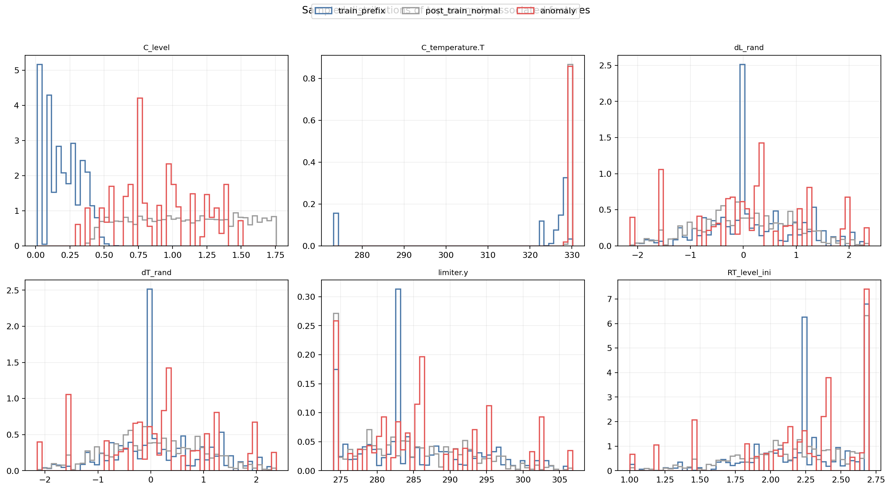

이 분석은 라벨과의 분포 연관성을 보여주지만, 해당 특성이 이상을 유발했다거나 라벨 시작 즉시 반응했다는 의미는 아니다. `event_feature_effects.csv`에는 각 이벤트 길이와 같은 크기(최대 2,000 samples)의 직전·직후 window를 이용한 평균 변화가 별도로 기록되어 있다.

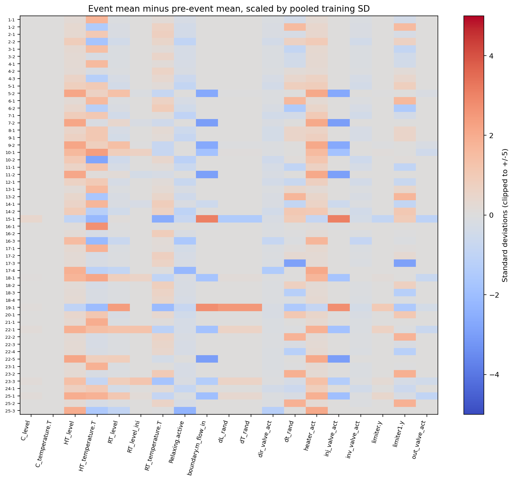

---

## 6. 학습 prefix와 이후 정상 구간의 분포 이동

각 파일 안에서 학습 prefix와 이후 `Label=0` 구간을 비교했다. 계산량과 파일 크기 영향의 균형을 위해 그룹별 최대 3,000행의 결정론적 표본을 사용했고, 파일별 KS를 동일 가중치로 집계했다.

| feature | contributing_files | mean_ks_statistic | median_ks_statistic | min_ks_statistic | max_ks_statistic |
| --- | --- | --- | --- | --- | --- |
| C_level | 25 | 0.97856 | 0.979333 | 0.964 | 0.999 |
| C_temperature.T | 25 | 0.97856 | 0.979333 | 0.964 | 0.999 |
| dL_rand | 25 | 0.357347 | 0.345 | 0.199 | 0.561 |
| dT_rand | 25 | 0.357347 | 0.345 | 0.199 | 0.561 |
| limiter.y | 25 | 0.353467 | 0.339333 | 0.199 | 0.561 |
| RT_level_ini | 25 | 0.342347 | 0.336333 | 0.199333 | 0.549 |
| RT_level | 25 | 0.250987 | 0.241 | 0.120667 | 0.404 |
| dt_rand | 25 | 0.132333 | 0.126 | 0.079 | 0.208333 |
| limiter1.y | 25 | 0.132333 | 0.126 | 0.079 | 0.208333 |
| RT_temperature.T | 25 | 0.0911467 | 0.0823333 | 0.0463333 | 0.154 |

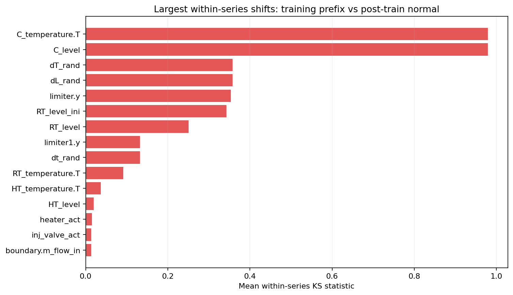

파일별 학습 prefix 평균도 서로 다를 수 있다. 아래 특성들은 파일 평균의 최대-최소 범위가 pooled 학습 표준편차 단위로 큰 순서다.

| feature | file_mean_range_in_global_train_sd |
| --- | --- |
| C_level | 1.64125 |
| dT_rand | 1.62741 |
| dL_rand | 1.62741 |
| limiter.y | 1.58946 |
| RT_level_ini | 1.19763 |
| RT_level | 1.08135 |
| C_temperature.T | 0.696105 |
| limiter1.y | 0.509394 |
| dt_rand | 0.509394 |
| RT_temperature.T | 0.300379 |

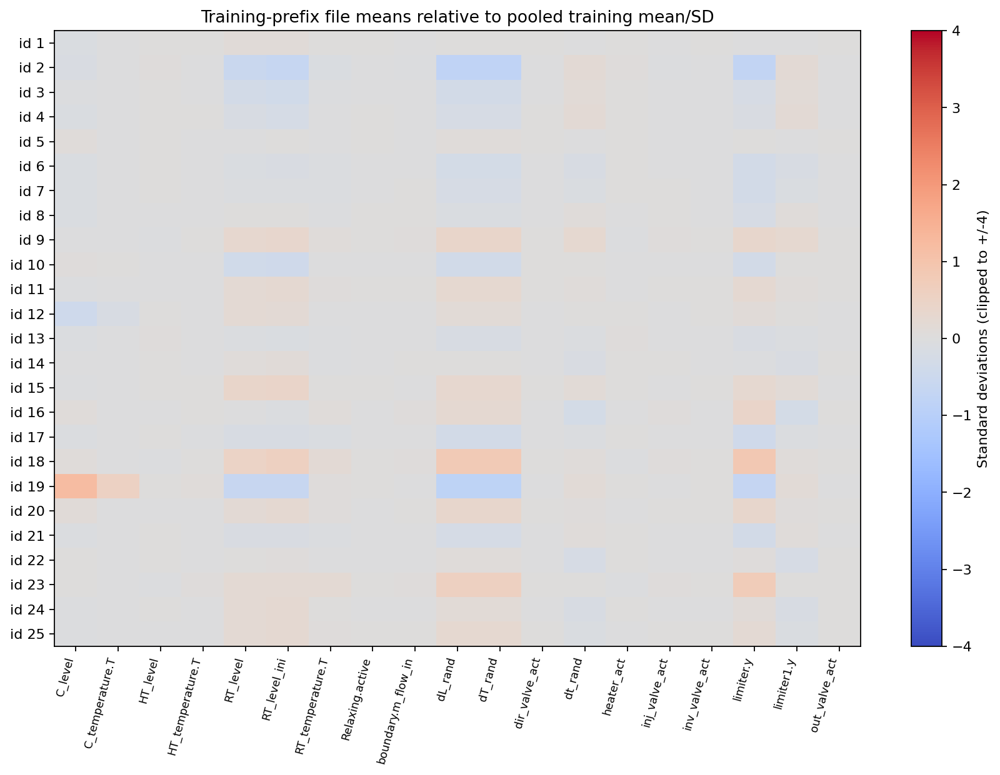

이 결과는 global scaler보다 학습 prefix에만 fit한 scaler, 파일 단위 분할, leave-one-series-out 검증을 고려할 이유가 된다. 단, 실제 벤치마크 프로토콜은 별도로 확인해야 한다.

---

## 7. 다변량 구조와 시간 의존성

학습 prefix의 결정론적 표본으로 Pearson 상관을 계산했다. |r| ≥ 0.95인 특성 쌍은 6개다.

| feature_1 | feature_2 | pearson_r | absolute_pearson_r |
| --- | --- | --- | --- |
| dT_rand | dL_rand | 1 | 1 |
| inj_valve_act | boundary.m_flow_in | 1 | 1 |
| dt_rand | limiter1.y | 1 | 1 |
| limiter.y | dL_rand | 0.972672 | 0.972672 |
| dT_rand | limiter.y | 0.972672 | 0.972672 |
| heater_act | HT_level | 0.956384 | 0.956384 |

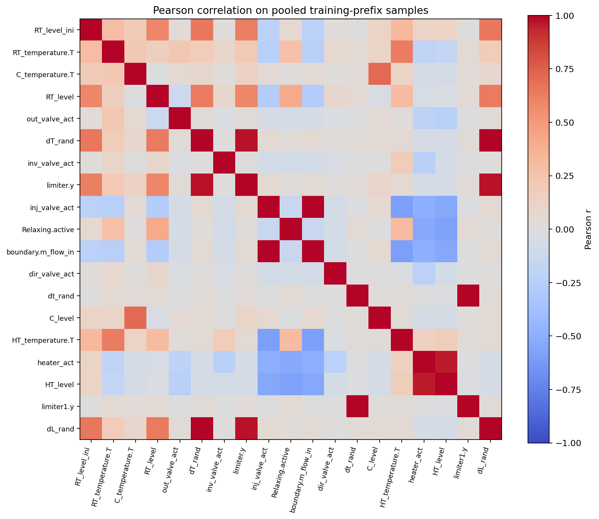

PCA는 학습 prefix 표본으로 scaling과 축을 fit한 뒤 이후 정상 및 이상 표본을 투영했다. 사용 가능 특성은 19개이며 PC1과 PC2 설명분산은 각각 46.36%, 14.37%다.

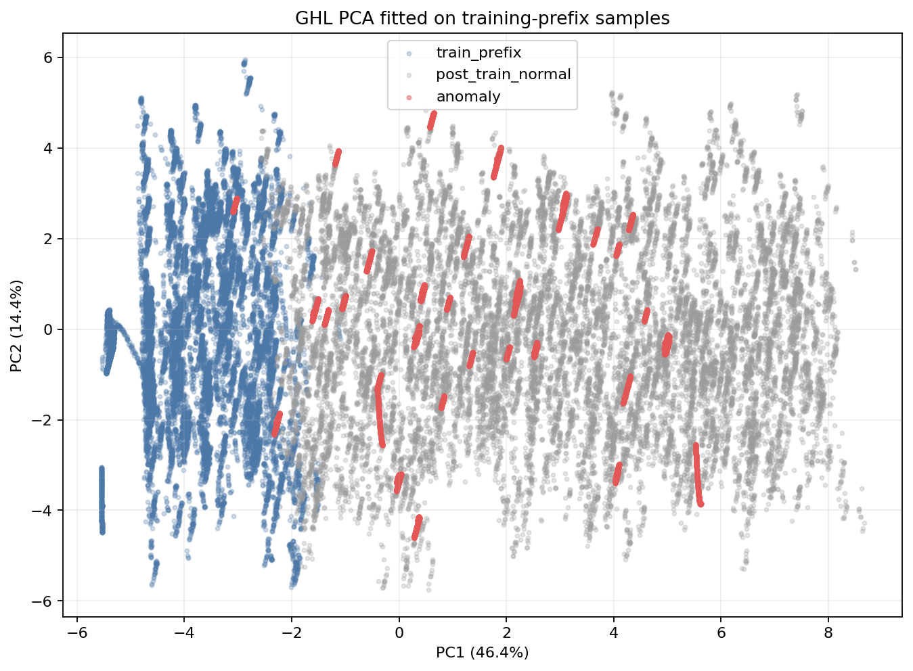

학습 prefix에서 계산한 lag별 평균 자기상관 상위 특성은 다음과 같다. lag는 실제 시간이 아닌 sample 수다.

| feature | lag_samples | autocorrelation |
| --- | --- | --- |
| C_level | 1 | 1 |
| C_temperature.T | 1 | 0.999999 |
| RT_temperature.T | 1 | 0.999996 |
| HT_temperature.T | 1 | 0.999946 |
| RT_level | 1 | 0.999925 |
| limiter.y | 1 | 0.99985 |
| dL_rand | 1 | 0.999834 |
| dT_rand | 1 | 0.999834 |
| HT_level | 1 | 0.999718 |
| RT_level_ini | 1 | 0.999655 |

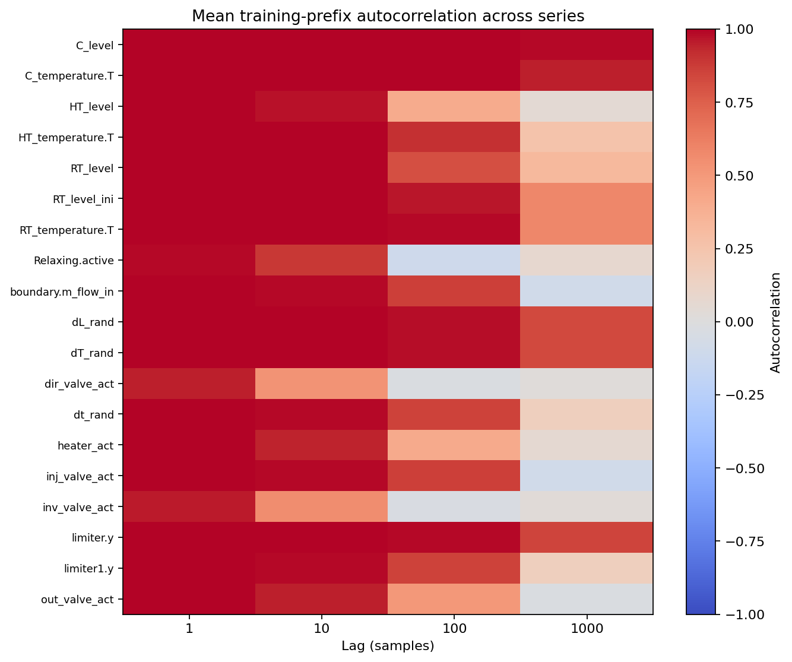

---

## 8. 모델링 전 권고사항

1. **파일 경계 유지:** 서로 다른 id를 연결해 window를 만들지 않는다. 이는 통계적 독립성 가정과 구분한다.
2. **열 이름 기준 정렬:** 온도 열 순서 변형 때문에 배열 위치를 그대로 신뢰하지 않는다.
3. **학습 prefix로만 전처리 fit:** 전체 파일에 fit하면 미래 평가 구간 정보가 누출될 수 있다.
4. **sample과 event 평가 병행:** point-wise metric만으로 긴 이벤트에 유리한 결과를 만들지 않는다.
5. **파일별 결과 보고:** pooled 점수와 함께 id별 점수 및 macro 평균을 제시한다.
6. **timestamp 해석 금지:** 샘플링 주기 근거가 확보되기 전에는 sample을 초·분으로 바꾸지 않는다.
7. **첫 이상 index 기준 명시:** `1st_*`를 0-based로 처리하고, 1-based 행 위치와 혼동하지 않는다.

---

## 9. 재현성과 산출물

분석은 `eda/ghl/run_ghl_eda.py`로 재실행할 수 있다. 정확 통계·결측·무한값·이벤트·파일 내부 정상/이상 KS는 전체 행을 사용했다. PCA·상관·학습/이후 정상 drift는 seed 고정 표본을 사용한다. 구체적인 옵션과 입력 파일은 `run_metadata.json`에 기록한다.

핵심 CSV와 그림 목록은 간결 보고서 `GHL_EDA_REPORT.md`의 산출물 절을 참고한다.
